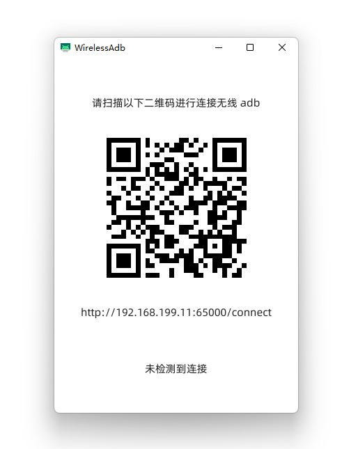

# WirelessAdbGo
一个帮助 Android 手机快速无线 adb 连接电脑的工具

使用 go + fyne 实现, 在 ubuntu + windows 上经过测试

## 原理
android 手机无线 adb 连接电脑的时候, 我们一般需要下面几个步骤
- 开发者模式打开无线调试
- 使用配对码 + 电脑端 `adb pair xxxx` 认证电脑
- 电脑端使用 `adb connect xxx` 命令连接手机

一般第二步的我们只需要进行一次, 让手机上面记住已配对设备即可

但是第三步的话我们每次都要输入一串 ip 地址和随机端口号

这不是反人类是啥?

## 解决方案
WirelessAdbGo 实现了一个电脑端和一个手机端

### 电脑端
开启一个 http 服务器, 其中有一个 api 接口可以接收 {ip} 和 {port} 两个参数

当收到来自这个接口的访问信息的时候, 解析处里面的参数

之后调用 `adb connect ip:port` 命令来尝试连接设备

电脑端还会显示一个二维码, 帮助手机扫码获取电脑侧的 ip + api 地址

### 手机端
获取 root 权限, 通过 `netstatus -nlp` 命令找到无线 adb 端口号

扫码获得电脑端的接口地址, 之后将手机本机的 ip + adb port 发送过去


### 最终效果
- PC 打开 WirelessAdbGo, 显示一个二维码
- 手机打开 WirelessAdb, 显示一个扫码连接按钮
- 手机扫描电脑屏幕二维码
- 无线 adb 连接建立成功

## 安装
### 电脑端
```shell
git clone github.com/Ericwyn/WirelessAdbGo.git
cd WirelessAdbGo
build.bat 
# linux 的话运行 build.sh
```

编译成功后回在 build-target 文件夹里面看到应用

**注意: 电脑端请安装最新 ADB 并设置为环境变量**

### 手机端
请从 [WirelessAdb](https://github.com/Ericwyn/WirelessAdb) 项目的 Release 页面下载

或者直接从源码编译

其实写的挺 ~~粗糙~~ 简单的 ~~简单能用就行~~

## 应用截图

| PC |Android|
| ---- | ---- |
|  ||